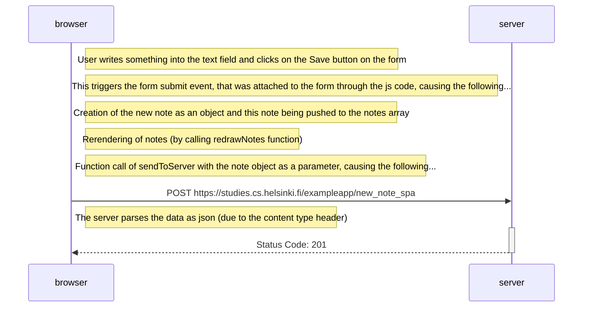

```mermaid
sequenceDiagram
participant browser
participant server

    Note right of browser: User writes something into the text field and clicks on the Save button on the form
    Note right of browser: This triggers the form submit event, that was attached to the form through the js code, causing the following...
    Note right of browser: Creation of the new note as an object and this note being pushed to the notes array
    Note right of browser: Rerendering of notes (by calling redrawNotes function)
    Note right of browser: Function call of sendToServer with the note object as a parameter, causing the following...
    browser->>server: POST https://studies.cs.helsinki.fi/exampleapp/new_note_spa
    Note right of browser: The server parses the data as json (due to the content type header)
    activate server
    server-->>browser: Status Code: 201
    deactivate server
```
